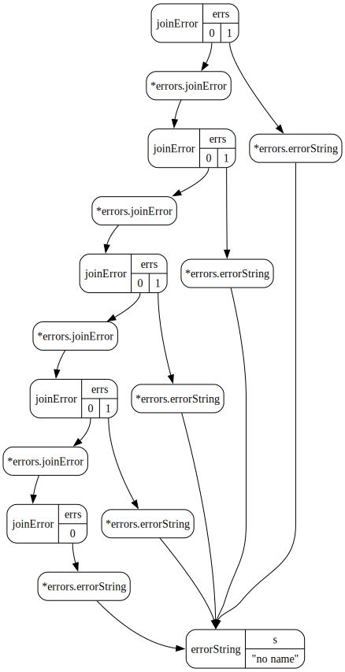
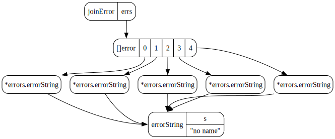

# errors

**tl;dr: Don't make linked lists with `errors.Join`.**

I have noticed a misuse of [`errors.Join`](https://pkg.go.dev/errors#Join) that looks roughly like this:

```go
// NOTE: This is bad, don't do this.
func validateAll(items []item) error {
    var err error

    for _, item := range items {
        err = errors.Join(err, validate(item))
    }

    return err
}
```

Instead of how it's meant to be used:

```go
// Do this instead.
func validateAll(items []item) error {
    var errs []error

    for _, item := range items {
        if err := validate(item); err != nil {
            errs = append(errs, err)
        }
    }

    return errors.Join(errs...)
}
```

## Why is this bad?

`errors.Join` combines any number of errors into a single error (or nil).
It doesn't attempt to flatten them, so every time you call `errors.Join` with a non-nil error, you allocate a new slice.
This is really nice because you can construct trees of errors and [do interesting things](https://github.com/chainguard-dev/apko/pull/1024) with them.

Unfortunately, if you use `errors.Join` as shown above, you end up making a linked list of errors, which is semantically weird and will perform poorly.
In a pathological case, you can end up with a very long list of errors, and anything that calls `errors.Is` (and friends) on your error will be slower because it has to traverse a linked list instead of contiguous memory.

## Visualizing The Problem

I used [memviz](https://github.com/bradleyjkemp/memviz) to visualize this because it's awesome and I'm lazy.

<details>

<summary>Code</summary>

```go
package main

import (
	"errors"
	"os"

	"github.com/bradleyjkemp/memviz"
)

func main() {
	items := make([]item, 5)
	berr := bad(items)
	gerr := good(items)
	memviz.Map(os.Stdout, berr)
	memviz.Map(os.Stdout, gerr)
}

type item struct {
	name string
}

var ErrEmptyName = errors.New("no name")

func validate(i item) error {
	if i.name == "" {
		return ErrEmptyName
	}

	return nil
}

func bad(items []item) error {
	var err error

	for _, item := range items {
		err = errors.Join(err, validate(item))
	}

	return err
}

func good(items []item) error {
	var errs []error

	for _, item := range items {
        if err := validate(item); err != nil {
		    errs = append(errs, err)
        }
	}

	return errors.Join(errs...)
}
```

</details>

### Bad

You can see how we have a linked list of `joinError`s.

</img>

### Good

Whereas we'd prefer a single `joinError`.

</img>

## Timing The Problem

I was curious if the performance difference was really all that meaningful, so I tried to write a benchmark.
I'm sure I am doing something stupid here, but overall the "bad" way only seems about 5x slower for both creation and use with `errors.Is`.
It's pretty unlikely for any program to ever be dealing with thousands of errors, so it probably doesn't matter all that much.

```
cpu: Apple M2 Pro
BenchmarkCreate/10/bad-12         	1970296	      594.6 ns/op
BenchmarkCreate/10/good-12        	3703785	      327.9 ns/op
BenchmarkCreate/100/bad-12        	 197274	     5971 ns/op
BenchmarkCreate/100/good-12       	 900351	     1313 ns/op
BenchmarkCreate/1000/bad-12       	  20235	    59921 ns/op
BenchmarkCreate/1000/good-12      	 121306	    10571 ns/op
BenchmarkCreate/10000/bad-12      	   1960	   629282 ns/op
BenchmarkCreate/10000/good-12     	   7387	   180513 ns/op

BenchmarkCheck/10/bad-12          	6049126	      197.8 ns/op
BenchmarkCheck/10/good-12         	12575979	       94.24 ns/op
BenchmarkCheck/100/bad-12         	 491799	     2402 ns/op
BenchmarkCheck/100/good-12        	1579392	      816.2 ns/op
BenchmarkCheck/1000/bad-12        	  49305	    24370 ns/op
BenchmarkCheck/1000/good-12       	 174525	     6920 ns/op
BenchmarkCheck/10000/bad-12       	   4784	   243597 ns/op
BenchmarkCheck/10000/good-12      	  17709	    68462 ns/op
```

<details>

<summary>Code for awful benchmark</summary>

```go
import (
	"errors"
	"io"
	"strconv"
	"testing"
)

type sut func([]item) error

var impls = map[string]sut{
	"bad":  bad,
	"good": good,
}

func BenchmarkCreate(b *testing.B) {
	for _, size := range []int{10, 100, 1_000, 10_000} {
		b.Run(strconv.Itoa(size), func(b *testing.B) {
			items := make([]item, size)
			for name, f := range impls {
				b.Run(name, func(b *testing.B) {
					b.ResetTimer()
					for range b.N {
						f(items)
					}
				})
			}
		})
	}
}

func BenchmarkCheck(b *testing.B) {
	for _, size := range []int{10, 100, 1_000, 10_000} {
		b.Run(strconv.Itoa(size), func(b *testing.B) {
			items := make([]item, size)
			for name, f := range impls {
				b.Run(name, func(b *testing.B) {
					err := f(items)
					b.ResetTimer()
					for range b.N {
						errors.Is(err, io.EOF)
					}
				})
			}
		})
	}
}
```

</details>

## Why is this common?

I suspect this is due to the API for hashicorp's [`go-multierror`](https://pkg.go.dev/github.com/hashicorp/go-multierror#Append), which worked differently from `errors.Join`.
If you were to mechanically translate from go-multierror to `errors.Join`, this would be the simplest thing to do, so I suspect that's why I keep running into this.

Another possible explanation is that it's less code.
In cases where you really expect no errors, the "bad" way saves two lines of code by outsourcing the `if err != nil` check to `errors.Join`, but that still ends up being at least twice as slow because you're checking two errors instead of one on every loop iteration (not to mention the function call overhead, assuming it doesn't get inlined).
Technically, you could omit the `if err != nil` check in the "good" way too, but you'd end up allocating and growing the `errs` slice just to fill it will `nil` errors that `errors.Join` discards.
As written currently, the "good" way doesn't allocate `errs` slice until you have at least one non-nil error.

Again, all of this probably doesn't matter that much in practice, but I'm writing it down so I can link people here instead of explaining it again in the future.
