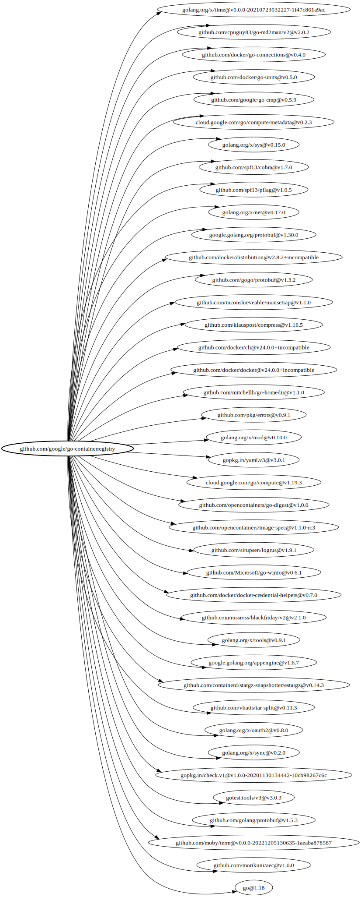

# graphjig

## Prologue 

Robin Sloan has this great article about how [An app can be a home-cooked meal](https://www.robinsloan.com/notes/home-cooked-app/).
Writing software just for yourself is really freeing.
Nobody is going to review this code, so I don't really care how it looks.
I don't have to care if it's extensible or testable or composable.
It's just for me.

I have two goals for this post:

1. Share a neat way that I like to use graphviz.
2. Give myself (and you, dear reader) permission to write more things like this.

For this particular example, it's less of a home-cooked app and more of a custom [jig](https://en.wikipedia.org/wiki/Jig_%28tool%29).
Most of the time, if I write some useful code, I try to extract the useful part out into a nicely composable tool.
This naturally limits your design choices a bit because you tend to optimize for composability over usability.
The reason I'm writing a post instead of publishing a tool is that I can't really turn this into a tool.
Instead, I'm going to show you how I like to compose a handful of tools into a purpose-built jig just for you.
I can show you how to make this style of jig, but the whole point of a jig is that it's custom made, so we can't make one that's suitable for every task.

For me, usually this kind of thing ends up as an unholy bash one-liner that lives mostly in my shell history.
The shell is wonderful for this because it's designed to compose tools together interactively.
That works for almost everything, but I haven't found any great way to visualize data in graphical and interactive way from my shell.
(This is an invitation to tell me about your favorite tool for this kind of thing.)

## Intro

I am very lazy and also very busy, so I love when I find a low effort high value technique for visualization.
We are going to build a dumb little program together to visualize a graph.
Hopefully, it will inspire you to write useful dumb little programs to visualize your own data.

I use graphviz a lot to organize my thinking with handwritten dot, so it's what I am familiar with.
Every once in a while I find the opportunity to generate graphviz diagrams from data.
This is where graphviz truly shines.

Because I usually write go, and go has a built in way to generate dependency graph data, I'm going to use that, but this should work pretty well for any graph-shaped data you might have lying around.

## Scaffolding

Let's start with some scaffolding:

```go
package main

import (
	"fmt"
	"log"
	"net"
	"net/http"
	"os/exec"
	"strings"

	"github.com/skratchdot/open-golang/open"
)

const dot = `
digraph example {
	server -> client [dir=back];
	server -> dot;
}
`

func main() {
	if err := run(); err != nil {
		log.Fatal(err)
	}
}

func run() error {
	l, err := net.Listen("tcp", "127.0.0.1:0")
	if err != nil {
		return err
	}

	server := &http.Server{
		Addr: l.Addr().String(),
	}

	http.HandleFunc("/", func(w http.ResponseWriter, r *http.Request) {
		if err := render(w, strings.NewReader(dot)); err != nil {
			fmt.Fprintf(w, "error: %v", err)
		}
	})

	if err := open.Run(fmt.Sprintf("http://localhost:%d", l.Addr().(*net.TCPAddr).Port)); err != nil {
		return err
	}

	return server.Serve(l)
}

func render(w http.ResponseWriter, r io.Reader) error {
	cmd := exec.Command("dot", "-Tsvg")
	cmd.Stdin = r
	cmd.Stdout = w

	return cmd.Run()
}
```

This is a little bit weird, but bear with me.
We're going to spin up an HTTP server that listens for requests and renders an graph as svg by shelling out to `dot`.
This assumes that you have both `dot` and a browser on your local machine, which is generally true or easy to make true.
I like to start with something like this because it gets your dev loop down to a reasonable latency without much fuss.

This graph we generate should look like this:

</img>

## Real Data

Okay, so now we have some code that opens the browser and displays a very basic hard-coded graph.
Let's display some actually interesting data.
As with dot, I'm just going to shell out to go.
I'm sure there's a good library for this, but text is the universal interface or whatever.
Remember, we're just building a jig.

The output format of `go mod graph` is space-delimited, so it's straightforward to use a hand-rolled parser.
Here, `gomod()` returns a map of maps to represent the dependency graph (mostly because go lacks sets).

```go
func gomod() (map[string]map[string]struct{}, error) {
	deps := map[string]map[string]struct{}{}

	cmd := exec.Command("go", "mod", "graph")
	out, err := cmd.StdoutPipe()
	if err != nil {
		return nil, err
	}

	if err := cmd.Start(); err != nil {
		return nil, err
	}

	scanner := bufio.NewScanner(out)
	for scanner.Scan() {
		line := scanner.Text()
		before, after, ok := strings.Cut(line, " ")
		if !ok {
			return nil, fmt.Errorf("weird line: %q", line)
		}

		if _, ok := deps[before]; !ok {
			deps[before] = map[string]struct{}{}
		}
		deps[before][after] = struct{}{}
	}

	return deps, errors.Join(scanner.Err(), cmd.Wait())
}
```

Then we'll write a very simple function that convers that map to `dot` format:

```go
func todot(w io.Writer, deps map[string]map[string]struct{}) {
	fmt.Fprintf(w, "digraph deps {\n")

	for k, v := range deps {
		for dep := range v {
			fmt.Fprintf(w, "\t%q -> %q;\n", k, dep)
		}
	}

	fmt.Fprintf(w, "}\n")
}
```

And we'll modify our `run()` function to fetch the data before we start the server:

```go
func run() error {
	deps, err := gomod()
	if err != nil {
		return err
	}

	l, err := net.Listen("tcp", "127.0.0.1:0")
	if err != nil {
		return err
	}

	server := &http.Server{
		Addr: l.Addr().String(),
	}

	http.HandleFunc("/", func(w http.ResponseWriter, r *http.Request) {
		var buf bytes.Buffer
		todot(&buf, deps)

		if err := render(w, &buf); err != nil {
			fmt.Fprintf(w, "error: %v", err)
		}
	})

	if err := open.Run(fmt.Sprintf("http://localhost:%d", l.Addr().(*net.TCPAddr).Port)); err != nil {
		return err
	}

	return server.Serve(l)
}
```

Now, if you `go run .`, it will pop up a browser that might look something like this:

</img>

Now we're getting somewhere!

## Too Much Data

Let's run that against a real repository, like maybe [go-containerregistry](https://github.com/google/go-containerregistry).

</img>

Well that sucks.
There is too much information to really see what's happening.
This is where it pays off that we are using an actual programming language to generate these graphs -- we can apply whatever logic we want!

So the most obvious thing to do here is to limit how much we display by only rendering a depth of 1 (this is also pretty east to implement).

```go

func run() error {
	root, deps, err := gomod()
	if err != nil {
		return err
	}

	l, err := net.Listen("tcp", "127.0.0.1:0")
	if err != nil {
		return err
	}

	server := &http.Server{
		Addr: l.Addr().String(),
	}

	http.HandleFunc("/", func(w http.ResponseWriter, r *http.Request) {
		var buf bytes.Buffer
		todot(&buf, root, deps)

		if err := render(w, &buf); err != nil {
			fmt.Fprintf(w, "error: %v", err)
		}
	})

	if err := open.Run(fmt.Sprintf("http://localhost:%d", l.Addr().(*net.TCPAddr).Port)); err != nil {
		return err
	}

	return server.Serve(l)
}

func render(w http.ResponseWriter, r io.Reader) error {
	cmd := exec.Command("dot", "-Tsvg")
	cmd.Stdin = r
	cmd.Stdout = w

	return cmd.Run()
}

func gomod() (string, map[string]map[string]struct{}, error) {
	root := ""
	deps := map[string]map[string]struct{}{}

	cmd := exec.Command("go", "mod", "graph")
	out, err := cmd.StdoutPipe()
	if err != nil {
		return "", nil, err
	}

	if err := cmd.Start(); err != nil {
		return "", nil, err
	}

	scanner := bufio.NewScanner(out)
	for scanner.Scan() {
		line := scanner.Text()
		before, after, ok := strings.Cut(line, " ")
		if !ok {
			return "", nil, fmt.Errorf("weird line: %q", line)
		}

		if root == "" {
			root = before
		}

		if _, ok := deps[before]; !ok {
			deps[before] = map[string]struct{}{}
		}
		deps[before][after] = struct{}{}
	}

	return root, deps, errors.Join(scanner.Err(), cmd.Wait())
}

func todot(w io.Writer, root string, deps map[string]map[string]struct{}) {
	fmt.Fprintf(w, "digraph deps {\n")
	fmt.Fprintf(w, "\trankdir=LR;\n")

	fmt.Fprintf(w, "\t%q;\n", root)
	for dep := range deps[root] {
		fmt.Fprintf(w, "\t%q -> %q;\n", root, dep)
	}

	fmt.Fprintf(w, "}\n")
}
```

When parsing `go mod graph`, we can just assume the first line contains the root element.
This will now only display direct dependencies of the root, but we throw away all the other nodes.

</img>

## Interactivity

> [!IMPORTANT]  
> This is the interesting part, pay attention.

So let's bring all those nodes back.

The big reveal here is that we can use the `href` property on a node to make it clickable.

```go
func run() error {
	root, deps, err := gomod()
	if err != nil {
		return err
	}

	l, err := net.Listen("tcp", "127.0.0.1:0")
	if err != nil {
		return err
	}

	server := &http.Server{
		Addr: l.Addr().String(),
	}

	http.HandleFunc("/", func(w http.ResponseWriter, r *http.Request) {
		if n := r.URL.Query().Get("n"); n != "" {
			root = n
		}
		var buf bytes.Buffer
		todot(&buf, root, deps)

		if err := render(w, &buf); err != nil {
			fmt.Fprintf(w, "error: %v", err)
		}
	})

	if err := open.Run(fmt.Sprintf("http://localhost:%d", l.Addr().(*net.TCPAddr).Port)); err != nil {
		return err
	}

	return server.Serve(l)
}

func todot(w io.Writer, root string, deps map[string]map[string]struct{}) {
	fmt.Fprintf(w, "digraph deps {\n")
	fmt.Fprintf(w, "\trankdir=LR;\n")

	fmt.Fprintf(w, "\t%q;\n", root)
	for dep := range deps[root] {
		href := fmt.Sprintf("?n=%s", dep)
		fmt.Fprintf(w, "\t%q [href=%q];\n", dep, href)
		fmt.Fprintf(w, "\t%q -> %q;\n", root, dep)
	}

	fmt.Fprintf(w, "}\n")
}
```

Now the root node comes dynamically from the URL, so we can click through the graph to manually traverse the dependcy graph and only show what we care about.

That's basically it.
Hopefully you have already thought about some domain specific modifications you could make to this to tailor it to your needs.
We can keep going, though!

Only showing deps in one direction is a bit limiting, since we would have to back all the way out to the root to find other paths.

Let's also show reverse deps, too:

</img>

(At this point I'm going to stop showing the code because it's getting too long, but the source is [here](./src/jig).)

Now we can understand quickly if this is something that is a common dependency or something that might be straightforward to remove (if we wanted).

## Getting Jiggy With It

Let's keep going!

Clicking around for interesting examples is tedious, so I'm going to add the count of deps to each node's label.

Also, a single node's deps in isolation are useful when you have have all the context of how you got to that node, but it's hard to serialize your short term memory in a way that you can share with someone else.
We have the current traversal in our browser history, but that's not very easy to visualize either.

Let's make a small modification to how we generate links so we can render the traversal.
Instead of setting the query string parameter, we are just going to append it.
Now the last element is our root, but we will render the path along to it.

Let's look at a traversal from `go-containerregistry` down to `logrus` through `tar-split`.

</img>

I've made the traversal bits a dashed line, and you can see that `testify` has 4 deps, which might be interesting to look at next.

This isn't the most useful thing in the world, but it also isn't totally useless!
If I wanted to get a general sense of a dependency graph, I might actually reach for this in the future.
An obvious next step might be to add more interesting details like the size of the total subgraph for each dep instead of just one level.

## Graphviz Maximalism

Once this is working well for your data, you will probably want to start making it show more useful things or show additional representations side by side.
If you are comfortable with frontend development, you have probably already thought of a better way to do everything I've talked about, so this whole post might not be for you.
However, if frontend terrifies you (as it does me), you can lean into the graphviz to make really magical experiences without writing any javascript.

A really useful trick that allows me to cling to graphviz almost indefinitely is the `record` node type.
Since graphviz is really graph-oriented, you might not think to use it for representing tabular data.
You might even think to yourself, "I guess I'll generate some HTML and embed the graphviz representation within it" so that you can use real tables.
If you hate that idea, consider the [`record`](https://graphviz.org/doc/info/shapes.html#record)!

For this example, let's use the same data but format every module/version pair as its own little table.

</img>

There are a lot of other neat little tricks you can use to stretch graphviz pretty far, but I'll save those for another post.

## Sharing is Caring

At some point, you might realize that other people would benefit from this.
Since this usually doesn't add many dependencies, it's not a huge deal to graft onto another tool, so I often just make it a `dot` subcommand of a more general tool with a `--web` flag for the interactive part.

You can also really easily just share an SVG with someone if they don't want to install a tool.

If you want to make this even more accessible, it's not hard to expose this as an actual service running on the internet (just spend some time hardening it first).

## Conclusion

Using graphviz with embedded links is a really easy way to make an interactive data visualization tool.

Since graphviz is declarative, you don't have to worry about how anything is actually laid out.
You also don't have to worry about javascript or HTML, since you graphviz generates an SVG and you can easily generate dot syntax is any language.

There's nothing particularly novel here -- graphviz is doing all the heavy lifting -- but I hope you find this technique useful for your own problems.

If I were less lazy, I'd host this interactive example somewhere, but the whole point of this post is that I'm really lazy, so I'm going to do the next best thing.
If you want to play with this yourself, run this:

```console
git clone https://github.com/jonjohnsonjr/til && cd til/post/graphviz/src/jig && go run .
```

That should pop open a browser for you to click around the jig dependency graph.
You can `go install` the `jig` tool and run it in any go repository to explore your own dependency graph.
