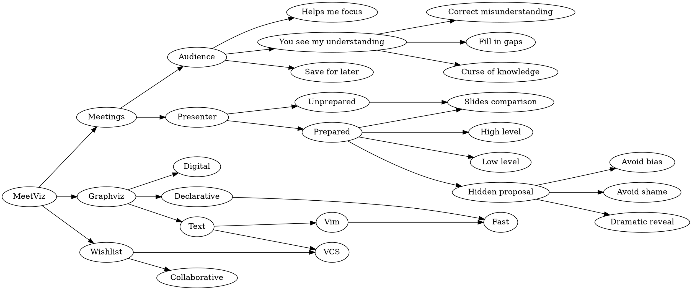

# MeetViz

If I can't visualize something, I'm completely lost.

## Meetings

Thanks in part to airborne viruses, my current job is completely remote.
A major downside of working remotely is that we don't have a shared, physical whiteboard for meetings.
In the beginning, this made meetings much less valuable for me.
Trying to convey complex ideas through English is like [the blind men and the elephant](https://en.wikipedia.org/wiki/Blind_men_and_an_elephant) playing [telephone](https://en.wikipedia.org/wiki/Telephone_game).
Add [high latency, low quality audio](https://www.benkuhn.net/vc/) to the mix, and you've got yourself a real "this could have been an email" situation.

Fortunately, I've found a strategy that helps me pay attention and makes meetings even more productive than they were in person:

**I use [graphviz](https://graphviz.org/) to diagram conversations in real time.**

It feels silly to write about this, as if "taking notes" is a huge insight, but this exact style of note-taking is the only thing that works for me, and it took me years to find it.

## Why Diagram

For context, I'm mostly talking about meetings with a small number of people trying to solve a specific problem or transfer knowledge.
I generally don't diagram "all hands" meetings or recurring "stand-up" meetings.

### As the Audience

If we're on a video call discussing anything remotely technical, you might see me glance to the side a lot.
Please don't be offended.
I do this when I'm actually paying attention, because I'm sketching out something with graphviz.
I've found this to be immensely helpful.
If I get confused, I can just share my screen and ask clarifying questions about the model I've built.

The diagram doesn't just show you what you've said: it shows you what _I've_ heard.
This short-circuits a lot of back-and-forth probing of our shared understanding.
You can just diff your mental model against my diagram and focus on where we diverge.

If I've misunderstood something, you can immediately correct it while I update the diagram until you're satisfied that we're on the same page.
It's also much faster to look at my diagram and _see_ if there's something you forgot to go over rather than try to remember what you've already said.

Sometimes, seeing my diagram might even produce some insight in _you_ because I don't suffer from the [curse of your knowledge](https://en.wikipedia.org/wiki/Curse_of_knowledge).
Building up a system from a literal blank slate often exposes some path-dependent decisions that are worth revisiting given the current context.
My lack of historical context can highlight those decisions because having to explain them to me makes you realize that things have changed.

Even if I don't get confused or feel the need to share my diagram, I still have a dense summary of our conversation to reference later.

### As the Presenter

If I'm the one presenting, I'm still diagramming.
Usually this is because I haven't had (or spent) time to prepare slides, but most of the time I still prefer graphviz to slides.
I'll concede that really good slides are better than graphviz diagrams, but good slides take time and effort to put together.
Even the best slides are static and linear, which requires you to over-prepare or be excellent at predicting your audience's needs.
Compare that to a simple graphviz diagram, which I can put together in seconds and tailor to the conversation as it evolves.

For meetings with a lot of people (where it makes sense to prepare), I'll put together 2-3 skeletal graphviz diagrams:

1. A high level diagram to give context or show how things fit together.
2. A low level diagram that includes all the relevant details for the conversation.
3. (Sometimes) A diagram showing my proposal for how to change the system.

The high level diagram is useful foundation for anyone who's new to the conversation.
It's also a good way to show all the things I've considered, so my audience can point out missing integration points.

The low level diagram is usually where we spend most of our time, and it's expected to be very mutable.
This is where we brainstorm and iterate on ideas, often producing a handful of new diagrams.
Many of those ideas are dead ends, which is fine, because we have a nice artifact explaining why we chose not to pursue it.

The final diagram is optional (or blank) because sometimes I don't know enough to have a proposal.
In cases where I do, I like to keep it in my back pocket until the end.

#### The Magic Trick

Three reasons I like to keep my proposal hidden until the end:

First, I want to get people's opinions without biasing them with my own.
If we start with my proposal, it [anchors](https://en.wikipedia.org/wiki/Anchoring_effect) the conversation in ways that can discourage radically different ideas.

Second, if my idea wasn't great, I can just pretend it doesn't exist!
Nobody has to know about it except for me.

Third, it can act as a dramatic reveal.
If the conversation starts naturally converging to my proposal, I'll say e.g. "like this?" and alt-tab into my proposal.
At the very least, this allows you to skip to the end and save everyone time.
In the best cases, this lends credibility to both you and the proposal.
You managed to arrive at the same conclusion independently, which makes you look smart.
The group arrived at the same conclusion as you, which shows that the proposal isn't just the result of [groupthink](https://en.wikipedia.org/wiki/Groupthink).
(An alternative explanation is that you're just very persuasive, but that can also make you look good.)

## Why Graphviz

Because it's not a physical whiteboard, it's quick to edit, undo, and save the diagram for later.
I can send links to people instead of sharing a grainy photo.

Because the syntax is declarative, I don't get slowed down by manually trying to lay things out in a legible way.
Graphviz is rarely perfect, but it always generates something good enough to get immediate feedback. 
Sometimes I'll use [tldraw](https://www.tldraw.com/) after the fact if I want to clean the diagram up, but I can't keep up with the meeting if I try to use tldraw from the beginning.

Because it's text-based, I can track changes to the dot file in git and add it to our docs.
It's also easily to share with other people because `dot` is a fairly ubiquitous program.
I can rapidly edit it using vim keystrokes without clicking around, which would both slow me down and be audibly distracting.

## How

Right now, I use [dreampuf/GraphvizOnline](https://github.com/dreampuf/GraphvizOnline) mostly because it's the first thing you get when you google for it, and if you hit `Cmd+,` you can enable vim mode.
The only thing that's really missing is collaboration.

## Wishlist

This system works well for me, but I do have a wishlist of things that could be better.
Maybe something like this already exists and I just need someone to read this post and tell me about it.

### Collaboration

I've found a collaborative graphviz editor in [menduz/diagrams](https://github.com/menduz/diagrams) (bonus: also supports sequence diagrams), but that doesn't seem to support vim mode.
If I weren't terrified of the javascript ecosystem, I would try to add vim mode to menduz's project, but it seems hard.

### Version Control

I have outsourced a surprising amount of my working memory to graphviz diagrams.
Over the last two weeks, I have accumulated 27 tabs of graphiz diagrams that I would be sad to lose.
A lot of them are just increasingly complex views of the same thing so that I can gently introduce my audience to a large and complicated system.

What I'd love is a way to automatically version control a diagram (and visualize that version control, probably using graphviz) in the browser.
I've used git for this, but it's slightly more friction than I want.
Something like [`jj`](https://github.com/jj-vcs/jj) but with a web frontend would be so convenient.

## Conclusion

This works well for me.
Perhaps it would work for you.
I would love to be on the receiving end of this!

For fun, here's [the diagram I used to outline this post](https://dreampuf.github.io/GraphvizOnline/?engine=dot#digraph%20G%20%7B%0A%20%20%20%20rankdir%3DLR%3B%0A%20%20%20%20%0A%20%20%20%20MeetViz%20-%3E%20%7BMeetings%2C%20Graphviz%2C%20Wishlist%7D%3B%0A%20%20%20%20%0A%20%20%20%20Meetings%20-%3E%20%7BAudience%2C%20Presenter%7D%3B%0A%20%20%20%20%0A%20%20%20%20Audience%20-%3E%20%7B%22Helps%20me%20focus%22%2C%20%22You%20see%20my%20understanding%22%2C%20%22Save%20for%20later%22%7D%3B%0A%20%20%20%20%22You%20see%20my%20understanding%22%20-%3E%20%7B%22Correct%20misunderstanding%22%2C%20%22Fill%20in%20gaps%22%2C%20%22Curse%20of%20knowledge%22%7D%0A%20%20%20%20%0A%20%20%20%20Presenter%20-%3E%20%7BUnprepared%2C%20Prepared%7D%3B%0A%20%20%20%20Unprepared%20-%3E%20%22Slides%20comparison%22%3B%0A%20%20%20%20Prepared%20-%3E%20%7B%22Slides%20comparison%22%2C%20%22High%20level%22%2C%20%22Low%20level%22%2C%20%22Hidden%20proposal%22%7D%3B%0A%20%20%20%20%22Hidden%20proposal%22%20-%3E%20%7B%22Avoid%20bias%22%2C%20%22Avoid%20shame%22%2C%20%22Dramatic%20reveal%22%7D%3B%0A%20%20%20%20%0A%20%20%20%20Graphviz%20-%3E%20%7BDigital%2C%20Declarative%2C%20Text%7D%3B%0A%20%20%20%20Declarative%20-%3E%20Fast%3B%0A%20%20%20%20Text%20-%3E%20%7BVim%2C%20VCS%7D%3B%0A%20%20%20%20Vim%20-%3E%20Fast%3B%0A%20%20%20%20%0A%20%20%20%20Wishlist%20-%3E%20%7BCollaborative%2C%20VCS%7D%3B%0A%7D) before turning it into prose.

For posterity (in case GitHub Pages dies), I'll embed the dot source, too:

meetviz.dot

