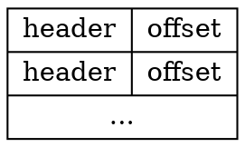

# tarfs

I wrote a little [`tarfs`](https://github.com/jonjohnsonjr/targz/tree/main/tarfs) package that I've found very useful.
If you ever have to work with tar files in Go, you might find it useful too.
Even if you don't, you might still learn something interesting by reading this post.

## What's a tar file?

Tar is short for "tape archive".
It's one of many ways to take a bunch of files and stuff them into a single file.
This is useful because many tools are built to handle single files and not entire filesystems.
You can also ignore the differences in filesystem implementations by forcing everything to serialize to a tar file.

Notably, since the tar format is meant for tape archives, it's not designed to allow for quick random access.
Tape drives are relatively slow, and archives imply that they aren't meant for online access.

There are several flavors of tar, but let's ignore that for now and focus on a simplified model of the format.

A tar file is a just a of records that alternate between a 512-byte header and the actual file contents.
The header contains metadata for the next file, including its name and size, which tells you how many bytes to read after the header.
After the end of each file, there is zero padding until the next 512-byte boundary.

After the last file, there are (at least) two 512 byte blocks of zeros that indicate the End Of Archive (EOA).


This format is easy to both produce and consume in a streaming manner, which means it's amenable to bash one-liners, which probably explains its ubiquity. 

Given the amount of zero-padding and text duplication common in the headers, tars are generally compressed with gzip to form a `.tar.gz` file, which is similarly amenable to bash one-liners.
 
## How do you work with tar files in Go?

If you search for how to do this, you'll find a [straightforward implementation](https://medium.com/@skdomino/taring-untaring-files-in-go-6b07cf56bc07).

<details><summary>(inlined implementation)</summary>

```
// Untar takes a destination path and a reader; a tar reader loops over the tarfile
// creating the file structure at 'dst' along the way, and writing any files
func Untar(dst string, r io.Reader) error {
	gzr, err := gzip.NewReader(r)
	if err != nil {
		return err
	}
	defer gzr.Close()

	tr := tar.NewReader(gzr)

	for {
		header, err := tr.Next()

		switch {

		// if no more files are found return
		case err == io.EOF:
			return nil

		// return any other error
		case err != nil:
			return err

		// if the header is nil, just skip it (not sure how this happens)
		case header == nil:
			continue
		}

		// the target location where the dir/file should be created
		target := filepath.Join(dst, header.Name)

		// the following switch could also be done using fi.Mode(), not sure if there
		// a benefit of using one vs. the other.
		// fi := header.FileInfo()

		// check the file type
		switch header.Typeflag {

		// if its a dir and it doesn't exist create it
		case tar.TypeDir:
			if _, err := os.Stat(target); err != nil {
				if err := os.MkdirAll(target, 0755); err != nil {
					return err
				}
			}

		// if it's a file create it
		case tar.TypeReg:
			f, err := os.OpenFile(target, os.O_CREATE|os.O_RDWR, os.FileMode(header.Mode))
			if err != nil {
				return err
			}

			// copy over contents
			if _, err := io.Copy(f, tr); err != nil {
				return err
			}
			
			// manually close here after each file operation; defering would cause each file close
			// to wait until all operations have completed.
			f.Close()
		}
	}
}
```

</details>

This kind of works, but there are a handful of problems.

### 1. Safety

Unless you can completely trust the tar file (i.e. you created it yourself), it's not safe to just extract it to a temporary directory.
This is due to a category of vulnerability called [Zip Slip](https://security.snyk.io/research/zip-slip-vulnerability).
A maliciously crafted tar file can have paths that escape the target directory using relative filenames (like `../../evil.sh`) and overwrite existing files with arbitrary content.

### 2. Completeness

This implementation only handles directories and regular files.
There are [other file types](https://pkg.go.dev/archive/tar#pkg-constants) that will just get silently ignored, most notably symlinks and hardlinks.

It also assumes that the target directory already exists for each regular file.
Most tar implementations do indeed include any directories before files in those directories, but this isn't guaranteed, so you may end up trying to write a file to a non-existent directory.

### 3. Orthogonality

This is just me being pedantic but this function assumes the input is gzipped, which isn't necessarily the case.
Sometimes you are just dealing with a tar file and don't need to gunzip it first.
In fact, assuming you need to gunzip it first constrains your thinking to serial access patterns, which makes it difficult to see a nicer solution.

## Access Patterns

One problem I'm fairly familiar with is reading a docker archive tarball.

I've described the layout of a docker archive [here](https://github.com/google/go-containerregistry/tree/main/pkg/v1/tarball#structure), but I'll repeat the relevant parts here.
A docker archive is a tarball that contains a `manifest.json` file and a bunch of other blob files.
The `manifest.json` file is an array, so it can contain multiple images.
In order to know which blobs you need to extract for a given image (and in which order), you need to open and parse the `manifest.json` file first.
This means we really want random access to the tar filesystem, so how can we get it?

There are a couple strategies here.

### 1. Just untar it

The most obvious thing to do is untar the entire thing and access it through the normal filesystem.

[Docker](https://github.com/moby/moby/blob/d1273b2b4a1fa511890035fbf75d299f345c5aaa/image/tarexport/load.go#L33) does this, but it's a lot more complicated than you might expect.

There's also file metadata within the tar that you may or may not want to preserve (like permissions, ownership, access times) which has security implications.

From [comments on their implementation](https://github.com/moby/moby/blob/d1273b2b4a1fa511890035fbf75d299f345c5aaa/pkg/chrootarchive/archive_unix.go#L52-L53):

```
// The implementation is buggy, and some bugs may be load-bearing.
// Here be dragons.
```

Note that I'm not trying to disparage docker's implementation at all, it just reflects the complicated reality of the problem.
Sometimes you do actually need to write out the files to disk, which indeed requires a lot of this ceremony if you have to handle untrusted inputs.

### 2. Schlemiel the Painter's Algorithm

Let's look at a different approach to the same problem.

This is in go-containerregistry, which means I'm at least partially responsible for it, so it's fair game to disparage.

Rather than untarring the entire thing to disk to give us random access, we can instead just re-open the tar file and read through it again until we find what we're looking for.
[This ends up being pretty slow](https://en.wikichip.org/wiki/schlemiel_the_painter%27s_algorithm), but it also avoid all the complexity and safety concerns of untarring it to disk.

## A better way

Both of these solutions were written before go introduced the `io/fs` package, which provides a really nice filesystem abstraction.
In fact, `fs.FS` is exactly the interface you usually want for a tar file.
It's a bit of a shame that the `archive/tar` package doesn't implement this interface, but it's not too hard to do it yourself, which is exactly what I've done in my `tarfs` package.

Notably, I'm not the first person to do this, but I do like my implementation the best.

### How `tarfs` works

When creating a new `tarfs.FS`, we first have to iterate over the whole tar file to build an index of the file offsets.
This is a little slow, but it's actually a requirement for correctness, and it can be amortized over many reads by saving the index for later use.

The index would look something like this:



Notice that this would only be 520 bytes per file instead of the entire file size, so it's relatively small.
Also, given that headers are pretty similar, this index should compress very well.
There is probably a much more compact format we could store these things in, but it's nice to have the identical data.

Separately, we'd have an in-memory mapping of filename to the index entry to give us random access to any file metadata.
In theory, we could store offsets to the header data so we don't store it twice, but by duplicating the header data, we can render the entire filesystem from just the index without actually having access to the original tar file.
This technique is useful to me for quickly rendering results on dag.dev.

The star of the show here is really [`io.ReaderAt`](./readat.md), which enables concurrent and efficient access to the bytes of the underlying tar file.

## When not to use tarfs

There are two scenarios where you might just want to use the plain tar package and not `tarfs`.

1. You only have an `io.Reader` and not an `io.ReaderAt`, e.g. if you're streaming the tar file from a network connection.
2. You are looking for a single entry in the tar file and are okay with exiting early.

If you find yourself in the second secnario, you should be careful.
It is not generally correct to assume that the first matching entry in a tar file is what you want to extract because tar files may contain duplicate entries.
Let me explain.

### Last write wins

First, let's create a tar file with a single entry:

```
echo -n "Hello, world" > hello.txt && tar -cf out.tar hello.txt
```

We can list the files:

```
tar -tvf out.tar
-rw-r--r--  0 jonjohnson staff      12 Jun 20 16:21 hello.txt
```

We can even extract the file:
```
tar -Oxf out.tar hello.txt
Hello, world
```

Instead of using `-c` to create a tar file, we can use `-r` to update it:

```
echo '!' >> hello.txt && tar -rf out.tar hello.txt
```

And we'll see that there are two entries:

````
tar -tvf out.tar
-rw-r--r--  0 jonjohnson staff      12 Jun 20 16:21 hello.txt
-rw-r--r--  0 jonjohnson staff      14 Jun 20 16:21 hello.txt
````

If we try to extract the file as before, we'll get both:
```
tar -Oxf out.tar hello.txt
Hello, worldHello, world!
```

But if you actually write it out to disk, you'll see that the last file wins:

```
mkdir out && tar -xf out.tar -C out && cat out/hello.txt
Hello, world!
```

For this reason, in the general case, you should read through the entire tar file before returning anything, because the file you care about might have been overwritten.

There are definitely situations where you know the layout of a tar file ahead of time (e.g. an APK package) where you know you can stop reading when you get to the first matching file, but a general purpose tar library can't make that assumption.

## Performance

To compare these approaches, I've summoned a random tar file from Docker Hub:

```
crane export ubuntu@sha256:9c704ecd0c694c4cbdd85e589ac8d1fc3fd8f890b7f3731769a5b169eb495809 > ubuntu.tar
```

And I've written three methods for accessing tar files:

1. `untar` which writes everything to a temporary directory, then deletes it afterwards,
2. `tarfs` which uses the `tarfs` package, and
3. `scantar` which re-scans through to access each file.

The dumb benchmark I have here is to read three files and write them to stdout.

```
untar < ubuntu.tar  0.04s user 0.54s system 98% cpu 0.588 total
tarfs < ubuntu.tar  0.02s user 0.01s system 97% cpu 0.028 total
scantar < ubuntu.tar  0.02s user 0.01s system 93% cpu 0.033 total
```

You can see that `untar` is the slowest because it has to actually write everything out to disk and also clean it up.

Since `tarfs` and `scantar` are read-only operations, they are both super fast.
We can cheat a little bit to give tarfs an advantage by looking at a bunch of files that are near the end of the tar file.

```
tarfs < ubuntu.tar  0.02s user 0.01s system 94% cpu 0.035 total
scantar < ubuntu.tar  0.08s user 0.05s system 98% cpu 0.128 total
```

We can see that `tarfs` is basically unaffected, whereas `scantar` is much slower because it's reading through almost the whole tar file for every file access.

## Disclaimer

I wouldn't attempt to put `tarfs` into production quite yet, but eventually I will extract it from its experimental home under [targz](https://github.com/jonjohnsonjr/targz).
